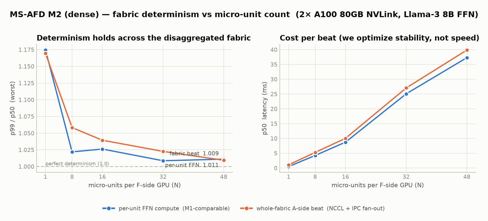

# M2 results — the dense fabric (cross-GPU NCCL routing + intra-GPU IPC fan-out)

**Hardware:** 2× NVIDIA A100-SXM4-80GB, **NV12 NVLink** between them, CUDA 12.8,
NCCL 2.25.1 (RunPod).
**Model:** Llama-3 8B dense FFN — SwiGLU, d_model=4096, d_intermediate=14336, fp16
storage / fp32 accumulation. Each micro-unit = one full FFN on a fixed token tile
(256 tokens), its own 768 MB static HBM arena, captured into a CUDA Graph — the
bit-for-bit M0/M1 FFN, now driven over the fabric.

<picture>
  <source media="(prefers-color-scheme: dark)" srcset="m2_determinism_dark.png">
  
</picture>

*Regenerate with `python bench/plot_m2.py results/m2/summary.csv results/m2/summary_aside.csv results/m2`.*

## What "M2 for a dense model" means

A dense model has **one** FFN per layer, not many experts — so "many micro-units"
comes from splitting **work**, not weights: the token batch is fanned out
**data-parallel**, every unit running the *same* FFN on its own tile. That keeps a
unit's FFN identical to M0/M1, so its per-beat p99/p50 is **directly comparable to
M1** — only now the tile arrives over NVLink and is dispatched through CUDA IPC.

The dataflow, one beat:

```
 A-side (GPU0, NCCL rank 0)          F-side (GPU1, NCCL rank 1)
 ─────────────────────────          ──────────────────────────
 scatter token tiles  ──NCCL/NVLink──▶  hub recv into IPC-shared buffer
                                        │  signal N MPS units (mmap control block)
                                        │  each unit runs its FFN graph on its tile
                                        ▼  (CUDA IPC — units are NOT NCCL ranks)
 gather results       ◀──NCCL/NVLink──  hub send gathered output back
```

This is niraj's MoE-fabric architecture (spikes **S1** = NCCL is CUDA-graph
capturable; **S1.5** = a per-GPU hub bridges to local MPS units over CUDA IPC,
because **NCCL allows only one rank per GPU**) applied to the dense track. `H=1`
here (1 A-side + 1 F-side GPU) is the minimal fabric; the same binary scales to
`H>1` F-side GPUs for true M2N routing.

## Sweep — determinism vs micro-unit count (partitioned, 100/N % SMs each)

**Per-unit FFN compute** (the M1-comparable metric — one row per unit, worst shown):

| N units | %/unit | p50 (median) | p99 (worst) | **p99/p50 (worst)** |
|---------|--------|--------------|-------------|---------------------|
| 1       | 100%   | 0.486 ms     | 0.571 ms    | 1.174 |
| 8       | 12%    | 4.236 ms     | 4.327 ms    | 1.022 |
| 16      | 6%     | 8.742 ms     | 8.972 ms    | 1.026 |
| 32      | 3%     | 25.076 ms    | 25.305 ms   | 1.009 |
| 48      | 2%     | 37.304 ms    | 37.699 ms   | **1.011** |

**Whole-fabric A-side beat** (scatter → fan-out → gather round trip, carries the
cross-GPU NCCL hop):

| N units | %/unit | p50 (median) | p99         | **p99/p50** |
|---------|--------|--------------|-------------|-------------|
| 1       | 100%   | 1.071 ms     | 1.253 ms    | 1.170 |
| 8       | 12%    | 5.272 ms     | 5.580 ms    | 1.058 |
| 16      | 6%     | 10.043 ms    | 10.438 ms   | 1.039 |
| 32      | 3%     | 27.063 ms    | 27.677 ms   | 1.023 |
| 48      | 2%     | 39.883 ms    | 40.259 ms   | **1.009** |

Cross-unit fairness is near-perfect (every unit's p50 within ~0.1–0.6% of the
others at each N; no unit is starved). Data integrity is 100% — every element of
every tile round-trips (the few exact zeros gathered are genuine fp16-rounded FFN
outputs).

## Soak — drift over 200,000 beats (N=16, ~33 min)

A single N=16 run of 200,000 beats (6% SM each). Split into the first vs last 10%
of beats, the distribution is unchanged — **no drift**:

| window            | p50 (ms) | p99 (ms) | p99/p50 |
|-------------------|----------|----------|---------|
| first 10%         | 10.057   | 10.422   | 1.036 |
| last 10%          | 10.049   | 10.486   | 1.044 |
| overall (200k)    | 10.059   | 10.400   | 1.034 |

p50 does not creep (10.057 → 10.049), and the tail ratio stays ~1.03–1.04 from
start to finish — no thermal or scheduling drift over the full run
(p99.9 = 10.990 ms overall).

## Takeaways

1. **The disaggregated dense fabric is deterministic across GPUs.** With the FFN
   split across an NVLink hop and dispatched via CUDA IPC to MPS micro-units, the
   whole-fabric beat holds **p99/p50 = 1.009 at 48 units** — as tight as a single
   slice, and the cross-GPU routing adds essentially no jitter (fabric beat tracks
   per-unit FFN within a few thousandths).
2. **Determinism *improves* as the GPU is carved finer** — the same M1 effect: a
   roughly constant scheduling/hop jitter amortizes as each unit's FFN gets longer
   (fewer SMs → longer beat), so the ratio tightens from 1.17 (N=1) to ~1.01 (N≥32).
3. **We measure rhythm, not speed.** p50 grows with N (each unit gets a thinner SM
   slice); the ratio is the metric, and it holds.

## Operational lessons (baked into the code / launcher)

- **Blocking sync is mandatory.** `cudaDeviceScheduleBlockingSync` + `sched_yield()`
  in every unit; with CUDA's default *spinning* sync a many-process MPS fleet
  starves itself (niraj's S1.5 saw a 24× blowup at 48 units).
- **The MPS 48-client limit is real.** An MPS server accepts at most 48 client CUDA
  contexts. Only the *units* are SM-capped micro-units that need MPS, so the A-side
  and hub run **outside** MPS (`env -u CUDA_MPS_*`) — leaving the whole 48-client
  budget for units, so N=48 fits exactly. (First attempt deadlocked: hub + 48 units
  = 49 clients, the 49th refused, hub waits forever.)
- One-rank-per-GPU is a hard NCCL rule → routing is at GPU granularity, with the
  per-GPU hub fanning out to local units over CUDA IPC.

## Reproduce

```bash
cmake -S . -B build -DCMAKE_CUDA_ARCHITECTURES=80 && cmake --build build -j
# one run: N units on 1 F-side GPU, 10k beats, partitioned SM share
bash scripts/run_m2_dense.sh 16 10000 6 1 768
# full sweep (unattended, survives disconnect):
nohup bash scripts/m2_dense_autorun.sh 10000 768 1 > m2d.out 2>&1 &
```

`summary.csv` (per-unit) and `summary_aside.csv` (fabric beat) hold the rows above.
The sweep also writes raw per-unit / per-beat CSVs under
`results/m2/m2_dense/partitioned_N*/` (not committed — regenerate via the sweep).
